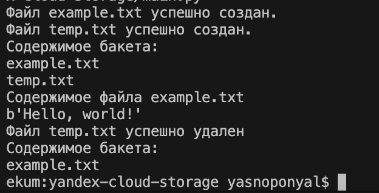

# Лабораторная работа. Объектное хранилище S3.
## Постановка задачи
1. Создайте бакет в Yandex Cloud
2. Создайте сервисный аккаунт
3. Реализуйте функции (локально) для выполнения основных операций с объектами в хранилище: получение списка загруженных файлов, загрузка файла в бакет, получение файла, удаление файла. Продемонстрируйте их работу.
## Код программы
```python
import boto3
import os
from dotenv import load_dotenv

load_dotenv()

s3 = boto3.client(
	's3',
	endpoint_url='https://storage.yandexcloud.net',
	aws_access_key_id=os.getenv('AWS_ACCESS_KEY_ID'),
  aws_secret_access_key=os.getenv('AWS_SECRET_ACCESS_KEY')
	)

# Сохранение файла
def upload_file(bucket, key, body):
	s3.put_object(Bucket=bucket, Key=key, Body=body)
	print(f"Файл {key} успешно создан.")

# Удаление файла
def delete_file(bucket, key):
	s3.delete_object(Bucket=bucket, Key=key)
	print(f'Файл {key} успешно удален')

# Получение содержимое бакета
def get_files(bucket):
	print("Содержимое бакета:")
	for key in s3.list_objects(Bucket=bucket)['Contents']:
		print(key['Key'])

# Получение содержимого файла
def get_file(bucket, key):
	object = s3.get_object(Bucket=bucket, Key=key)
	print(f'Содержимое файла {key}')
	print(object['Body'].read())

if __name__ == "__main__":
	upload_file('compworkshop', 'example.txt', 'Hello, world!')
	upload_file('compworkshop', 'temp.txt', 'This file will be delete')

	get_files('compworkshop')

	get_file('compworkshop', 'example.txt')

	delete_file('compworkshop', 'temp.txt')

	# Содержимое бакета после удаления temp.txt
	get_files('compworkshop')
```
## Пояснение к коду
1. Cохраняем два файла example.txt и temp.txt
2. Выводим содержимое бакета
3. Выводим содержимое файла example.txt
4. Удаляем файл temp.txt
5. Выводим содержимое бакета ещё раз
## Результат работы

